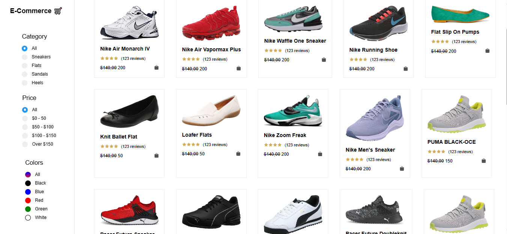

# Simple React Ecommerce Webpage



Welcome to the Simple React Ecommerce Webpage! This project is a basic example of an ecommerce webpage built using React. The webpage allows users to browse through products, add them to the cart, and proceed to checkout.

## Table of Contents
- [Introduction](#introduction)
- [Installation](#installation)
- [Usage](#usage)
- [Technologies Used](#technologies-used)
- [Contributing](#contributing)
- [License](#license)

## Introduction

Ecommerce webpages are a fundamental part of online businesses, and this project demonstrates the fundamental features required in such a website. The webpage is built using React to provide an interactive and responsive user experience.

## Installation

To run the project locally on your machine, follow these steps:

1. Clone the repository to your local machine:
   ```
   git clone https://github.com/tarunkeshukumar/react-ecommerce-webpae/.git
   cd react-ecommerce-webpage
   ```

2. Install the required dependencies using npm:
   ```
   npm install
   ```

## Usage

To start the development server and run the application, use the following command:
   ```
   npm start
   ```

The application will be accessible at `http://localhost:3000` in your web browser.

## Technologies Used

The Simple React Ecommerce Webpage uses the following technologies:

- React
- HTML5
- CSS3
- JavaScript

## Contributing

Contributions to improve the Simple React Ecommerce Webpage are welcome! If you find any issues or have ideas for enhancements, please feel free to create a pull request or open an issue in the GitHub repository.

Before contributing, please read our [contribution guidelines](CONTRIBUTING.md) to understand the process.

## License

This project is licensed under the [MIT License](LICENSE). Feel free to use, modify, and distribute the code for your purposes.

---

I hope that you enjoy exploring the Simple React Ecommerce Webpage. If you have any questions or feedback, please don't hesitate to reach out. Happy shopping!
